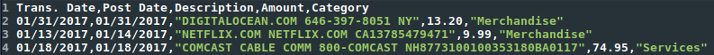
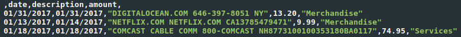

# LIA (Ledger Import Assistant)

LIA is a simple command-line python application that can help import exported Cedit Card and Bank statement csv files into a ledger journal file. There are several other great ledger convert/import options out there, but many more complicated than what I was looking for. So...I decided to write my own tool. Thus, LIA.

### Features:
- CSV files are read in and converted to simple ledger journal statements.
- Data order is recognized by a header mechanism
- Prompts the user to potentially edit the transaction information (defaults to csv value)
- Manual transaction entry (if desired)
- Supports multiple destination accounts
- Automatic placement system. The user can specify a file containing rules to automatically place transactions. (ex: anything with "Dunkin" in the description will default to _Expenses:Food:Coffee_)
- Colored prompts

## Execution Instructions
*will write installer in future*

1. Clone the repository

   `git clone https://github.com/himmAllRight/LIA.git`

2. Move to the project directory

    `cd LIA`

3. Run the `lia` (with options, see below for more)

    `python3 lia -f visa-statement.csv -o output-file.dat -a "Liabilities:VISA`

## Run Instructions
#### Setting up the Input File Header
First, the input file needs to be setup so that LIA can properly understand the data order for parsing. To do this, just open up the .csv file and add a header. Many exported CSV files will already contain some sort of data header which can be used to write the LIA header.

For example, when I export my credit card transactions to a CSV, it contains the header:

`Trans. Date,Post Date,Description,Amount,Category`

LIA by contrast, need headers for ``"description"``, `"date"`. and `"amount"`* (all in lowercase). So, using the current header contents for reference, I edited by adding in the three keywords mentioned above, and replaced any extrainous ones with blanks between the commas. For example:

`date,,description,amount,`

Note: I can have other values marked in the header for my convenience, but LIA will currently only recognize these three. It is intended to eventually have the others utilized in the automatic rules system. For example, in my test input file, I have the header set to the following, even though I do not use "posted" for anything.

`date,posted,description,amount,`

\* *In the future there might be more options, but for now LIA only recognizes these three.*

#### Starting LIA
LIA is a python app, so currently the method to run it is by running `lia.py` with python. Python 2 and 3 should both be supported, but 3 is preferred. You will have to provide a few required arguments, and can also specify a few optional ones. All of the command line options are listed in the table below.

example:
`python3 lia -f credit-card.csv -o ledger.dat -a "Liabilities:CreditCard:Discover" -d "%m/%d/%Y" -c`

### Command Line Options
This table lists all of the command line options for LIA. The first column states the flag to use when calling the option. The second column provides a small description of the option, while the third column states if it is a required parameter. Lastly, the fourth column defines if you need to provide a value to the argument to the option (_ex: `-f` needs a file path after it, but you just need to write `-w` to use the overwrite option_).

| Flags | Description | Required? | Provide Value?|
|-------|-------------|-----------|---------------|
| -f, --import | Input csv file to convert. If not provided just reads from cache | Yes | Yes |
| -o, --output | Output ledger file name/path | Yes | Yes |
| -w, --overwrite | Overwrites the output file. (Normally Appends by default) | No | No |
| -a, --import-account | The account the import data is from | Yes | Yes |
| -d, --date-format | The date format for dates in the input (ex: "%m/%d/%Y") | No | Yes |
| -r, --rules | Specify a file that contains rules for automatic Account placements | No | Yes |
| -c, --color | Switch on colors in prompt | No | No |
| -h | Help | No | No |

### Example
`python3 lia -f credit-card.csv -o ledger.dat -a "Liabilities:CreditCard:Discover" -d "%m/%d/%Y" -c`

### Remaining TODO for 1.0 Release
- [X] Output appends, unless --overwrite flag
- [X] When looping through an input file, it copies the input file to a temp and pops items off as it works through them. This way, if you stop part-way through, you can pick up where it was last left off.
- [X] Users can simply input new transactions, without improting a csv.
- [X] User can setup rules/parsers to default transaction placement. (ex: anything from "cumberland farms" will default to Expenses:Transportation:Gas)
- [X] When user edits data, default values are editable in the prompt
- [ ] Build simple install system
- [ ] Update README file
  - [X] Update Current Readme content
  - [X] Write Install Instructions
  - [ ] Write Use Instructions
