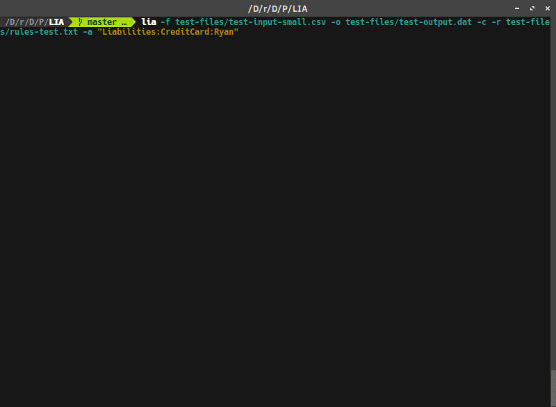

# LIA (Ledger Import Assistant)
[](https://travis-ci.org/himmAllRight/LIA/)



LIA is a simple command-line python application that can help import exported Cedit Card and Bank statement csv files into a ledger journal file. There are several other great ledger convert/import options out there, but many are more complicated than what I was looking for. So...I decided to write my own tool. Thus, LIA.

### Features:
- CSV files are read in and converted to simple ledger journal statements.
- Data order is recognized by a header mechanism
- Prompts the user to potentially edit the transaction information (defaults to csv value)
- Manual transaction entry (if desired)
- Supports multiple destination accounts
- Automatic placement system. The user can specify a file containing rules to automatically place transactions. (ex: anything with "Dunkin" in the description will default to _Expenses:Food:Coffee_)
- Colored prompts

## Installation Instructions
### Using setup.py

(You may need to install python's setuptools for this)

1. Clone the repository

   ```git clone https://github.com/himmAllRight/LIA.git```

2. Move to the project directory

    ```cd LIA```

3. Run the `setup.py` with the install option. Note: you may need to install python's setuptools/disutils to do this:

	```python3 setup.py install```

After that, LIA should be installed and can be run using the terminal command: `lia`.

Note: Lia can also be run by executing the `lia` script directly.

### Building a Solus eopkg
Being a Solus user, I have created and included a solbuild `package.yml` file for LIA (found at `pkg/package.yml`). An eopkg can be built using this file and solbuild by running the following command:

```sudo solbuild build package.yml```

A `lia*.eopkg` file should be now be generated. To install it, use eopkg:

```sudo eopkg it lia*.eopkg```

[Ledger](http://ledger-cli.org/) is listed as a run dependency, so if it is not installed, eopkg will also pull and install it [from the Solus repos](https://git.solus-project.com/packages/ledger/). When it finishes installing, LIA should be good to go.

## Run Instructions

#### Setting up the Input File Header
First, the input file needs to be setup so that LIA can properly understand the data order for parsing. To do this, just open up the .csv file and add a header. Many exported CSV files will already contain some sort of data header which can be used to write the LIA header.

For example, when I export my credit card transactions to a CSV, it contains the header:

`Trans. Date,Post Date,Description,Amount,Category`


LIA by contrast, need headers for ``"description"``, `"date"`. and `"amount"`* (all in lowercase). So, using the current header contents for reference, I edited by adding in the three keywords mentioned above, and replaced any extrainous ones with blanks between the commas. For example:

`date,,description,amount,`


Note: I can have other values marked in the header for my convenience, but LIA will currently only recognize these three. It is intended to eventually have the others utilized in the automatic rules system. For example, in my test input file, I have the header set to the following, even though I do not use "posted" for anything.

`date,posted,description,amount,`

\* *In the future there might be more options, but for now LIA only recognizes these three.*

#### Starting LIA
If installed as instructed above, LIA can be run with the terminal command: `lia`. You will also have to provide a few required arguments, and can optionally specify a few others. All of the command line options are listed in the table below.

example:
`lia -c -m -o ledger.dat -a "Liabilities:CreditCard:Discover"`

### Command Line Options
This table lists all of the command line options for LIA. The first column states the flag to use when calling the option. The second column provides a small description of the option, while the third column states if it is a required parameter. Lastly, the fourth column defines if you need to provide a value to the argument to the option (_ex: `-f` needs a file path after it, but you just need to write `-w` to use the overwrite option_).

| Flags | Description | Required? | Provide Value?|
|-------|-------------|-----------|---------------|
| -f, --import | Input csv file to convert. If not provided just reads from cache | No | Yes |
| -m, --manual | Manually write new transactions instead of a file import | No | No |
| -o, --output | Output ledger file name/path | Yes | Yes |
| -w, --overwrite | Overwrites the output file. (Normally Appends by default) | No | No |
| -a, --import-account | The account the import data is from | Yes | Yes |
| -d, --date-format | The date format for dates in the input (ex: "%m/%d/%Y") | No | Yes |
| -r, --rules | Specify a file that contains rules for automatic Account placements | No | Yes |
| -c, --color | Switch on colors in prompt | No | No |
| -h | Help | No | No |

### Example
`lia -f credit-card.csv -o ledger.dat -a "Liabilities:CreditCard:Discover" -d "%m/%d/%Y" -c`

## Auto Rules

Lia contains a feature called Auto Rules. These are simple rules defined in a file, that specify ways transactions can be automatically placed in a account. For example, I can set a rule so that if a transaction description contains "Dunkin", it will default my secondary account value to be "Expenses:Food:Coffee", so I don't have to type it in. I can just hit enter if it is right, or edit it if not (like all the other data items work). 

Rules in a rules file are ordered by preference. So if a more than one rule applies to a transaction, the one closest to the top of the file (ex: line 3 vs line 20), will be applied.

Example Rule File (see `test-files/rules-test.txt`)  

```
description=Dunk -> Expenses:Food:Coffee
description=NETFLIX -> Expenses:Entertainment:Subscriptions
description=YMCA -> Expenses:Health:Gym
description=Stop & Shop -> Expenses:Food:Groceries
description=Stop and Shop -> Expenses:Food:Groceries
description=Comcast -> Expenses:Utilities:Internet
description=Panera -> Expenses:Food:Cafe
```